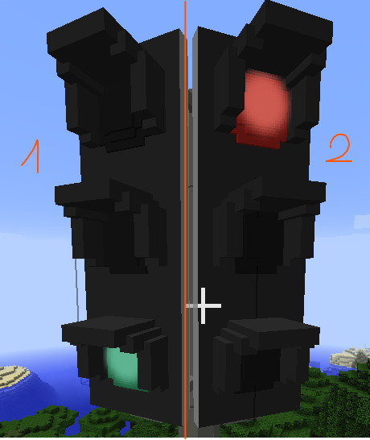
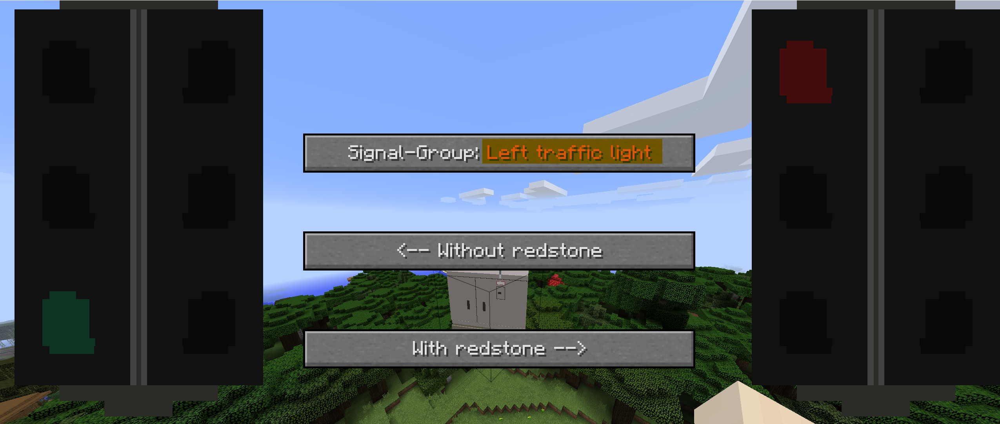
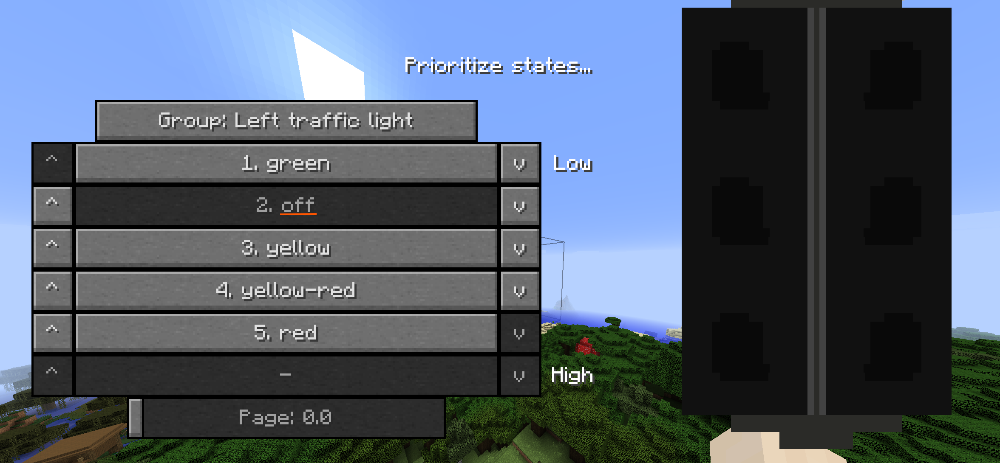

# ComplexSignals (BLOCKCOMPLEXSIGNAL)

## Description 

This is a more flexible signal, it is more complex but lets you do way more with the signal than the BLOCKSIGNAL.<br />
[:octicons-arrow-right-24: Signal documentation](./Signal.md)

## Structure

!!! info "Information regarding the structure"

    Multiple OBJs, Base and References can be used for single and multiple signals as well.<br />
    The following example show a few possibilities, but there are more constellations possible.

=== "Single group"
    
    ``` json linenums="1" title="singlegroup.json"
    {
      "id": "simple-single-lamp", // (1)!
      "name": "Simple Single Lamp Signal", // (2)!
      "rotationSteps": 10, // (3)!
      "signals": { // (4)!
        "main_lamp": { // (5)!
          "groupName": "Main lamp", // (6)!
          "states": { // (7)!
            "off": { // (8)!
              "signalName": "Off", // (9)!
              "models": { // (10)!
                "singlelampsignal/singlelampsignal.obj": [ // (11)!
                  {
                    "textures": "off", // (12)!
                    "item": { // (13)!
                      "DEFAULT": { // (14)!
                        "translation": [ // (15)!
                          0.625,
                          0.125,
                          0
                        ],
                        "rotation": [ // (16)!
                          0,
                          180,
                          0
                        ],
                        "scaling": [ // (17)!
                          0.8,
                          0.8,
                          0.8
                        ]
                      }
                    },
                    "block": { // (18)!
                      "translation": [ // (19)!
                        0.5,
                        0,
                        0.5
                      ],
                      "rotation": [ // (20)!
                        0,
                        180,
                        0
                      ],
                      "scaling": [ // (21)!
                        1,
                        1,
                        1
                      ]
                    }
                  }
                ]
              }
            },
            "white": {
              "signalName": "White",
              "models": {
                "singlelampsignal/singlelampsignal.obj": [
                  {
                    "textures": "white",
                    "item": {
                      "DEFAULT": {
                        "translation": [
                          0.625,
                          0.125,
                          0
                        ],
                        "rotation": [
                          0,
                          180,
                          0
                        ],
                        "scaling": [
                          0.8,
                          0.8,
                          0.8
                        ]
                      }
                    },
                    "block": {
                      "translation": [
                        0.5,
                        0,
                        0.5
                      ],
                      "rotation": [
                        0,
                        180,
                        0
                      ],
                      "scaling": [
                        1,
                        1,
                        1
                      ]
                    }
                  }
                ]
              }
            },
            "red": {
              "signalName": "Red",
              "models": {
                "singlelampsignal/singlelampsignal.obj": [
                  {
                    "textures": "red",
                    "item": { //
                      "DEFAULT": {
                        "translation": [
                          0.625,
                          0.125,
                          0
                        ],
                        "rotation": [
                          0,
                          180,
                          0
                        ],
                        "scaling": [
                          0.8,
                          0.8,
                          0.8
                        ]
                      }
                    },
                    "block": {
                      "translation": [
                        0.5,
                        0,
                        0.5
                      ],
                      "rotation": [
                        0,
                        180,
                        0
                      ],
                      "scaling": [
                        1,
                        1,
                        1
                      ]
                    }
                  }
                ]
              }
            }
          }
        }
      }
    }
    ```

    1.  !!! info "The identifier of the block and item."
        !!! failure "Required field!"
        
        !!! warning "Needs to be unique!<br />If more than one block within the same contentpack has the same id, only one will be loaded."
        
        !!! danger "Should not be changed!<br />Changing the id will break existing blocks."
    
    2.  !!! info "The name of the block and item."
        !!! failure "Required field!"
        
        !!! note "Can be changed later on.<br />Does not have to be unique, although that helps."

    3.  !!! info "The steps in which the block can be rotated."
        !!! quote "Optional field."
        !!! abstract "Default value: 10<br />Allowed values: 10 - 90"
    
        !!! note "Can be changed later on."

    4.  !!! info "Includes all the groups your signal has.<br />Groups are independent parts of your signal.<br />One signalbox can only control one independent part.<br />Groups do not interact with each other."
        !!! failure "Required field!<br />Needs atleast one entry."

        

        !!! note "Should be able to be changed later on. (Not tested!)"
            !!! info "Adding new groups is no issue."
            !!! danger "Removing groups may break existing blocks."
    
    5.  !!! info "A group that can be selected by a signalbox"
        !!! failure "Required field!"

        !!! danger "Should not be changed!"
            Changing the group id will most likely break existing blocks.

    6.  !!! info "The name of this group"
        !!! failure "Required field!"
        
                

        !!! note "Can be changed later on."

    7.  !!! info "The different states this group has"
        !!! failure "Required field!<br />Needs atleast one entry."
        
        !!! note "The order of the states is important as they overwrite each other."
            The first state is the lowest and the last state the highest in priority.<br />
            The first state will also be the default state for the item and for a newly placed block.<br />
            The order can be changed for each placed block individually by clicking on it.

        !!! note "Can be changed later on."
            !!! info "Adding new states is no issue."
            !!! danger "Removing states may break existing blocks."

    8.  !!! info "The identifier of the state"
        !!! failure "Required field!"
        
        !!! danger "Should not be changed!"
            Changing the state id will most likely break existing blocks.

    9.  !!! info "The name of the state"
        !!! failure "Required field!"

        

        !!! note "Can be changed later on."

    10. !!! info "List of all the OBJ files you want to use."
        !!! failure "Required field!"
            Atleast one entry is required!
        In this example only a single obj file is used.<br />
        Look at ['+ multiple OBJs'](./#-multiple-objs) for another example.

        !!! note "Can be changed later on."
            !!! warning "This may cause the UniversalModCore cache to break.<br />You can try to delete the `/cache/landofsignals/` folder in your minecraft instance."
    
    11. !!! info "The path to the OBJ you want to use. "
        !!! failure "Required field!"
    
        !!! tip "Path does not require `/assets/landofsignals/`."

        !!! note "The name and content of the file can be changed later on."
            !!! warning "This may cause the UniversalModCore cache to break.<br />You can try to delete the `/cache/landofsignals/` folder in your minecraft instance."

    12. !!! info "The name of the folder containing the correct textures for this OBJ and state."
        !!! quote "Optional field."
        !!! info "Will use the textures within the same folder as the OBJ when not specified."

        !!! note "The name and content of the file can be changed later on."
        !!! warning "This may cause the UniversalModCore cache to break.<br />You can try to delete the `/cache/landofsignals/` folder in your minecraft instance."

    13. !!! info "Contains properties like translation, rotation and/or scaling for the item"
        !!! quote "Optional field."

    14. !!! info "Place where the item should be rendered."
        !!! quote "Optional field."
        
        !!! abstract "Allowed properties"
            DEFAULT<br />
            THIRD_PERSON_LEFT_HAND<br />
            THIRD_PERSON_RIGHT_HAND<br />
            FIRST_PERSON_LEFT_HAND<br />
            FIRST_PERSON_RIGHT_HAND<br />
            HEAD<br />
            GUI<br />
            ENTITY<br />
            FRAME

        !!! note "Can be changed later on."
        
    15. !!! info "The translation of the item."
        !!! quote "Optional field."
        !!! abstract "Default value: 0.5, 0.5, 0.5"

        !!! warning "Is affected by `scaling` as `translation` happens afterward."

        !!! warning "Affects `rotation` as `translation` happens beforehand."
        
        !!! note "Can be changed later on."

    16. !!! info "The rotation of the item."
        !!! quote "Optional field."
        !!! abstract "Default value: 0, 0, 0"

        !!! warning "Is affected by `scaling` and `translation` as `rotation` happens afterward."
        
        !!! note "Can be changed later on."

    17. !!! info "The scaling of the item."
        !!! quote "Optional field."
        !!! abstract "Default value: 1, 1, 1"

        !!! warning "Affects `translation` and `rotation` as `scaling` happens beforehand."
        
        !!! note "Can be changed later on."
    
    18. !!! info "Contains properties like translation, rotation and/or scaling for the block"
        !!! quote "Optional field."
        
    19. !!! info "The translation of the block."
        !!! quote "Optional field."
        !!! abstract "Default value: 0.5, 0.5, 0.5"

        !!! warning "Is affected by `scaling` as `translation` happens afterward."

        !!! warning "Affects `rotation` as `translation` happens beforehand."
        
        !!! note "Can be changed later on."
            !!! warning "May screw up the positioning of existing blocks."

    20. !!! info "The rotation of the block."
        !!! quote "Optional field."
        !!! abstract "Default value: 0, 0, 0"

        !!! warning "Is affected by `scaling` and `translation` as `rotation` happens afterward."
        
        !!! note "Can be changed later on."
            !!! warning "May screw up the positioning of existing blocks."

    21. !!! info "The scaling of the block."
        !!! quote "Optional field."
        !!! abstract "Default value: 1, 1, 1"

        !!! warning "Affects `translation` and `rotation` as `scaling` happens beforehand."
        
        !!! note "Can be changed later on."
            !!! warning "May screw up the positioning of existing blocks."

=== "+ references"
    
    ```json linenums="1" title="singlegroup-ref.json"
    {
      "id": "simple-single-lamp", // (1)!
      "name": "Simple Single Lamp Signal", // (2)!
      "rotationSteps": 10, // (3)!
      "references": {
        "contentPackItemRefs": {
          "defaultItem": {
            "translation": [ // (15)!
              0.625,
              0.125,
              0
            ],
            "rotation": [ // (16)!
              0,
              180,
              0
            ],
            "scaling": [ // (17)!
              0.8,
              0.8,
              0.8
            ]
          }
        },
        "contentPackBlockRefs": {
          "defaultBlock": {
            "translation": [ // (19)!
              0.5,
              0,
              0.5
            ],
            "rotation": [ // (20)!
              0,
              180,
              0
            ],
            "scaling": [ // (21)!
              1,
              1,
              1
            ]
          }
        }
      },
      "signals": { // (4)!
        "main_lamp": { // (5)!
          "groupName": "Main lamp", // (6)!
          "states": { // (7)!
            "off": { // (8)!
              "signalName": "Off", // (9)!
              "models": { // (10)!
                "singlelampsignal/singlelampsignal.obj": [ // (11)!
                  {
                    "textures": "off", // (12)!
                    "itemRefs": {
                      "DEFAULT": "defaultItem"
                    },
                    "blockRef": "defaultBlock"
                  }
                ]
              }
            },
            "white": {
              "signalName": "White",
              "models": {
                "singlelampsignal/singlelampsignal.obj": [
                  {
                    "textures": "white",
                    "itemRefs": {
                      "DEFAULT": "defaultItem"
                    },
                    "blockRef": "defaultBlock"
                  }
                ]
              }
            },
            "red": {
              "signalName": "Red",
              "models": {
                "singlelampsignal/singlelampsignal.obj": [
                  {
                    "textures": "red",
                    "itemRefs": {
                      "DEFAULT": "defaultItem"
                    },
                    "blockRef": "defaultBlock"
                  }
                ]
              }
            }
          }
        }
      }
    }
    ```
    
    1.  !!! info "The identifier of the block and item."
        !!! failure "Required field!"
        
        !!! warning "Needs to be unique!<br />If more than one block within the same contentpack has the same id, only one will be loaded."
        
        !!! danger "Should not be changed!<br />Changing the id will break existing blocks."
    
    2.  !!! info "The name of the block and item."
        !!! failure "Required field!"
        
        !!! note "Can be changed later on.<br />Does not have to be unique, although that helps."

    3.  !!! info "The steps in which the block can be rotated."
        !!! quote "Optional field."
        !!! abstract "Default value: 10<br />Allowed values: 10 - 90"
    
        !!! note "Can be changed later on."

    4.  !!! info "Includes all the groups your signal has.<br />Groups are independent parts of your signal.<br />One signalbox can only control one independent part.<br />Groups do not interact with each other."
        !!! failure "Required field!<br />Needs atleast one entry."

        

        !!! note "Should be able to be changed later on. (Not tested!)"
            !!! info "Adding new groups is no issue."
            !!! danger "Removing groups may break existing blocks."
    
    5.  !!! info "A group that can be selected by a signalbox"
        !!! failure "Required field!"

        !!! danger "Should not be changed!"
            Changing the group id will most likely break existing blocks.

    6.  !!! info "The name of this group"
        !!! failure "Required field!"
        
                

        !!! note "Can be changed later on."

    7.  !!! info "The different states this group has"
        !!! failure "Required field!<br />Needs atleast one entry."
        
        !!! note "The order of the states is important as they overwrite each other."
            The first state is the lowest and the last state the highest in priority.<br />
            The first state will also be the default state for the item and for a newly placed block.<br />
            The order can be changed for each placed block individually by clicking on it.

        !!! note "Can be changed later on."
            !!! info "Adding new states is no issue."
            !!! danger "Removing states may break existing blocks."

    8.  !!! info "The identifier of the state"
        !!! failure "Required field!"
        
        !!! danger "Should not be changed!"
            Changing the state id will most likely break existing blocks.

    9.  !!! info "The name of the state"
        !!! failure "Required field!"

        

        !!! note "Can be changed later on."

    10. !!! info "List of all the OBJ files you want to use."
        !!! failure "Required field!"
            Atleast one entry is required!
        In this example only a single obj file is used.<br />
        Look at ['+ multiple OBJs'](./#-multiple-objs) for another example.

        !!! note "Can be changed later on."
            !!! warning "This may cause the UniversalModCore cache to break.<br />You can try to delete the `/cache/landofsignals/` folder in your minecraft instance."
    
    11. !!! info "The path to the OBJ you want to use. "
        !!! failure "Required field!"
    
        !!! tip "Path does not require `/assets/landofsignals/`."

        !!! note "The name and content of the file can be changed later on."
            !!! warning "This may cause the UniversalModCore cache to break.<br />You can try to delete the `/cache/landofsignals/` folder in your minecraft instance."

    12. !!! info "The name of the folder containing the correct textures for this OBJ and state."
        !!! quote "Optional field."
        !!! info "Will use the textures within the same folder as the OBJ when not specified."

        !!! note "The name and content of the file can be changed later on."
        !!! warning "This may cause the UniversalModCore cache to break.<br />You can try to delete the `/cache/landofsignals/` folder in your minecraft instance."

    13. !!! info "Contains properties like translation, rotation and/or scaling for the item"
        !!! quote "Optional field."

    14. !!! info "Place where the item should be rendered."
        !!! quote "Optional field."
        
        !!! abstract "Allowed properties"
            DEFAULT<br />
            THIRD_PERSON_LEFT_HAND<br />
            THIRD_PERSON_RIGHT_HAND<br />
            FIRST_PERSON_LEFT_HAND<br />
            FIRST_PERSON_RIGHT_HAND<br />
            HEAD<br />
            GUI<br />
            ENTITY<br />
            FRAME

        !!! note "Can be changed later on."
        
    15. !!! info "The translation of the item."
        !!! quote "Optional field."
        !!! abstract "Default value: 0.5, 0.5, 0.5"

        !!! warning "Is affected by `scaling` as `translation` happens afterward."

        !!! warning "Affects `rotation` as `translation` happens beforehand."
        
        !!! note "Can be changed later on."

    16. !!! info "The rotation of the item."
        !!! quote "Optional field."
        !!! abstract "Default value: 0, 0, 0"

        !!! warning "Is affected by `scaling` and `translation` as `rotation` happens afterward."
        
        !!! note "Can be changed later on."

    17. !!! info "The scaling of the item."
        !!! quote "Optional field."
        !!! abstract "Default value: 1, 1, 1"

        !!! warning "Affects `translation` and `rotation` as `scaling` happens beforehand."
        
        !!! note "Can be changed later on."
    
    18. !!! info "Contains properties like translation, rotation and/or scaling for the block"
        !!! quote "Optional field."
        
    19. !!! info "The translation of the block."
        !!! quote "Optional field."
        !!! abstract "Default value: 0.5, 0.5, 0.5"

        !!! warning "Is affected by `scaling` as `translation` happens afterward."

        !!! warning "Affects `rotation` as `translation` happens beforehand."
        
        !!! note "Can be changed later on."
            !!! warning "May screw up the positioning of existing blocks."

    20. !!! info "The rotation of the block."
        !!! quote "Optional field."
        !!! abstract "Default value: 0, 0, 0"

        !!! warning "Is affected by `scaling` and `translation` as `rotation` happens afterward."
        
        !!! note "Can be changed later on."
            !!! warning "May screw up the positioning of existing blocks."

    21. !!! info "The scaling of the block."
        !!! quote "Optional field."
        !!! abstract "Default value: 1, 1, 1"

        !!! warning "Affects `translation` and `rotation` as `scaling` happens beforehand."
        
        !!! note "Can be changed later on."
            !!! warning "May screw up the positioning of existing blocks."

=== "+ base"

    * Lorem ipsum

=== "+ multiple OBJs"

    * Lorem ipsum

=== "Multiple groups"

    * Lorem ipsum

=== "& base"

    * Lorem ipsum

=== "Everything"

    * Lorem ipsum

## States

### Implementation

### Sorting, priorities and overwriting of states

## Flares

<div class="grid cards" markdown>

-   :material-flare:{ .lg .middle } __Flares__ *(optional, nice to have)*

    ---

    { width="300" }
    { width="300" }

    If your model contains lamps or other parts that are supposed to glow, this is the right place.<br />
    Flares are oriented to your models and light up when the right state is set.<br />
    They can be added to signals, complex signals, deco/assets, signs and levers.

    [:octicons-arrow-right-24: Flare documentation](./Flares.md)

</div>