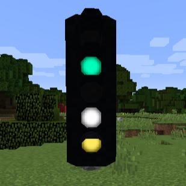
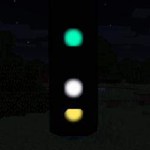
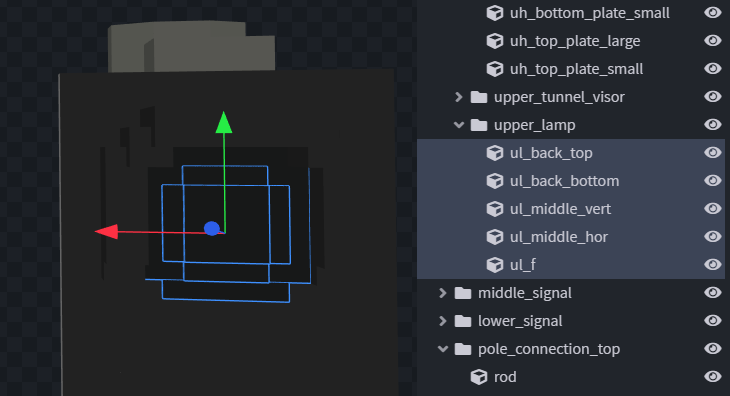
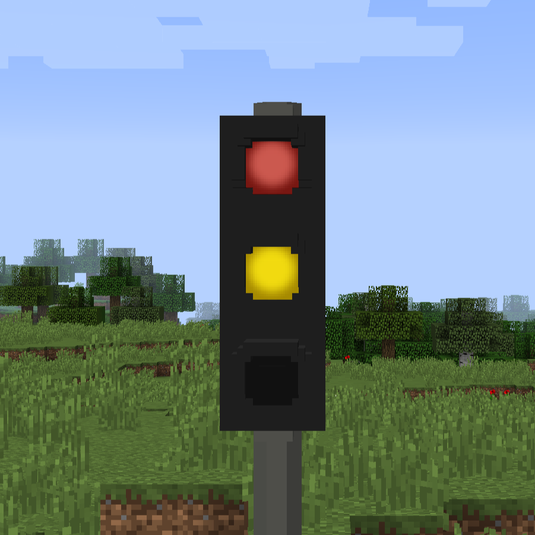
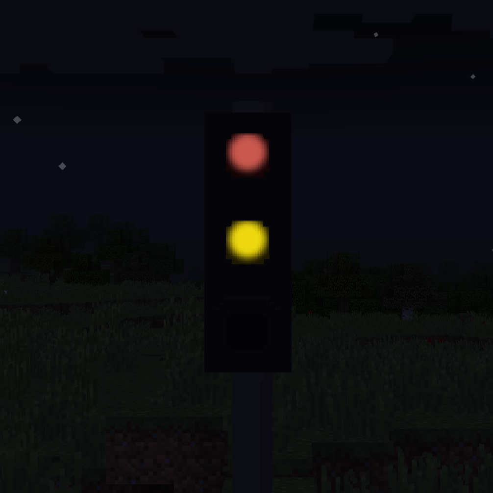
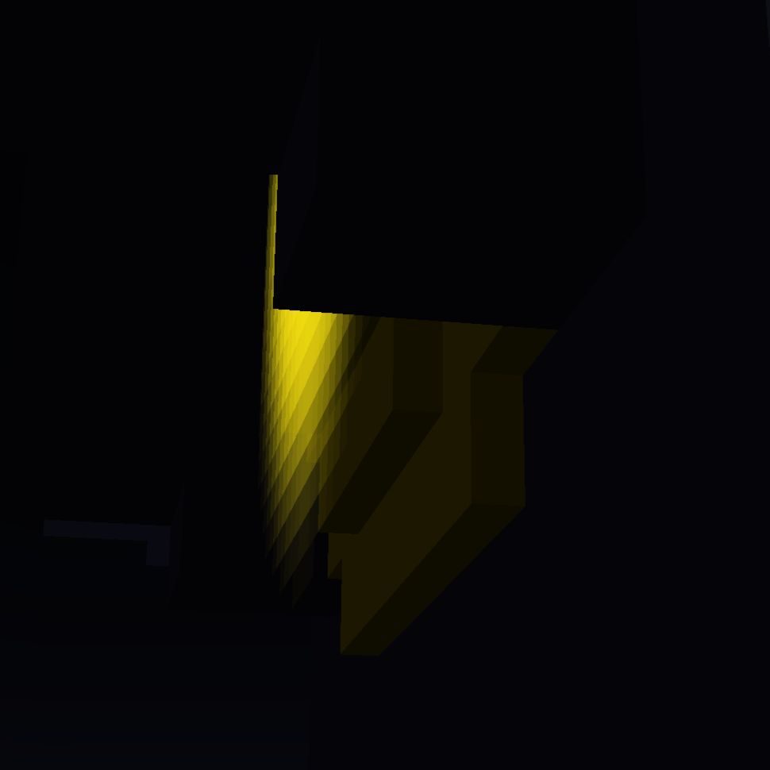

# Flares

{ width="300" }
{ width="300" }

## Description 

Flares are overlays that glow independent of the surrounding lighting.\
They allow signals to be seen from a larger distance.

=== "Flares for assets & signs"
    
    ```json
    "flares": [  // (1)!
        {
            "id": "ul", // (2)!
            "color": "165;32;25", // (3)!
            "rotation": 180, // (4)!
            "postRotation": 0, // (5)!
            "pitch": 0, // (6)!
            "offset": 0.019, // (7)!
            "scalingMultiplier": 1,  // (8)!
            "alwaysOn": true,  // (9)!
            "objPath": "testpack/trafficlight/trafficlight.obj", // (10)!
            "objPathIndex": 0, // (11)!
            "objGroups": [ // (12)!
                "sign" // (13)!
            ],
            "texture": "flare_texture.png",  // (14)!
            "scaleWithDistance": false // (15)!
        },{
            "id": "ml",
            "color": "229;189;1",
            "rotation": 180,
            "postRotation": 0,
            "pitch": 0,
            "offset": 0.019,
            "scalingMultiplier": 1,
            "alwaysOn": true,
            "objPath": "testpack/trafficlight/trafficlight.obj",
            "objPathIndex": 0,
            "objGroups": [
                "sign"
            ],
            "texture": "flare_texture.png",
            "scaleWithDistance": false
        }
    ]
    ```

    1.  !!! info "The list of flares you want for you assets and signs."
        !!! quote "Optional field."
        !!! abstract "Default value: []"

    2.  !!! info "The ID of the flare, used to determine how large the lamp has to be."
        !!! failure "Required field!"
        !!! quote "Despite the name, it does not have to be unique."
        
        !!! abstract "The mod will look for parts of your sign that start with the name of the id.<br />Those should only be the glowing parts (lamp, etc.)"
            

    3.  !!! info "The color your flare should glow in."
        !!! quote "Optional field."
        !!! abstract "Default value: 0xFFFFFF (255,255,255 / white)"

        !!! note "You can add your desired color in these formats:"
            === "RGB"
    
                === ","
                
                    ```json
                    {
                        "color": "0,127,255"
                    }
                    ```
                
                === ";"
                
                    ```json
                    {
                        "color": "0;127;255"
                    }
                    ```
                
                === ":"
                
                    ```json
                    {
                        "color": "0:127:255"
                    }
                    ```
                
                === "-"
                
                    ```json
                    {
                        "color": "0-127-255"
                    }
                    ```
            
                
            
            === "HEX"
                
                === "#"
                
                    ```json
                    {
                        "color": "#007fff"
                    }
                    ```
                
                === "0x"
                
                    ```json
                    {
                        "color": "0x007fff"
                    }
                    ```

        
        

    4.  !!! info "The default rotation of the flare."
        !!! failure "Required field!"
        !!! abstract "Most likely value: 0 or 180"

    5.  !!! info "The post rotation of the flare."
        !!! quote "Optional field.<br />This rotation will be applied AFTER the translation (incl. offset)."
        !!! example "Slightly experimental."
        !!! abstract "Default value: 0"

    6.  !!! info "The pitch of the flare. Should it point more up- or downards?"
        !!! quote "Optional field."
        !!! abstract "Default value: 0<br />Should most likely be the default value."

    7.  !!! info "The offset of the flare from the center of the groups found via the ID."
        !!! failure "Required field!"
        !!! abstract "Value will probably be in this range: 0.005 - 0.045"
        
        

    8.  !!! info "The scaling multiplier of the flare.<br />Used to fix size issues with the flares."
        !!! quote "Optional field."
        !!! abstract "Default value: 1"

    9.  !!! info "Should the flare always be on?"
        !!! quote "Optional for assets & signs.<br />Will be ignored as those block do not have different states."
        !!! abstract "Should be true or false."

    10. !!! info "The corresponding objPath"
        !!! warning "Optional field. Required if your sign uses multiple different OBJ files."
        !!! abstract "Default value: First obj-path in your asset or sign under "base"."

    11. !!! info "The index of the OBJ that should be used."
        !!! warning "Optional field. Required if you use the same OBJ more than once under "base"."
        !!! abstract "Default value: 0<br />First element starts at 0."

    12. !!! info "The obj groups used to center the flare"
        !!! warning "Optional field. Required if you use a signal with an irregular shape."

    13. !!! info "The obj group used to center the flare"
        !!! warning "Optional field. Required if you use a signal with an irregular shape."
    
    14. !!! info "The texture for the flare."
        !!! quote "Optional field."
        !!! abstract "Default value: default flare"
        
        !!! note "Your own texture could look like this:"
            <div style="width: 310px; display: flex">
                
                
            </div>
            !!! info "Default flare <<>> Custom flare example<br/>The background of the file should be transparent.<br />We added a black background to make it visible in the documentation."

    15. !!! info "Should the flare scale larger with distance?"
        !!! quote "Optional field."
        !!! abstract "Default value: false"

        !!! example "Slightly experimental."

=== "Flares for levers"

=== "Flares for signals"

=== "Flares for complexsignals"

