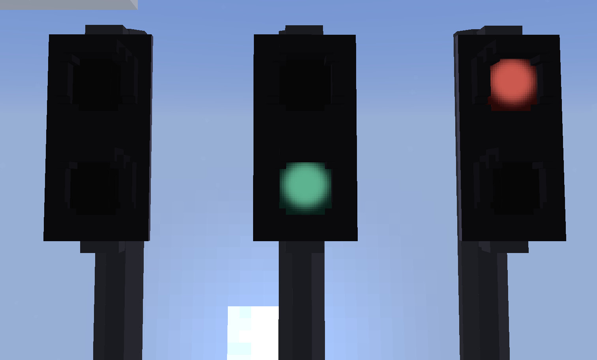
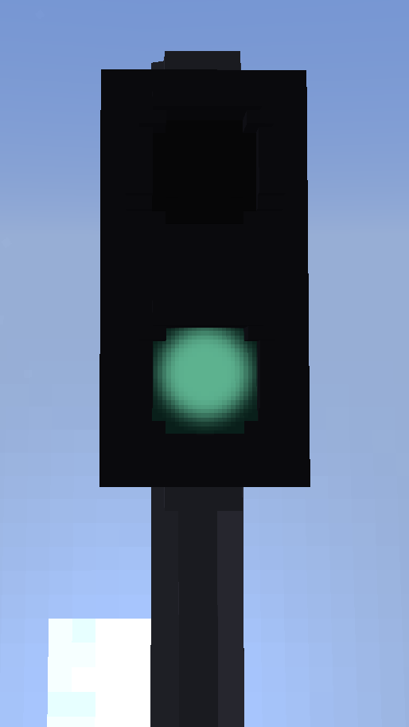
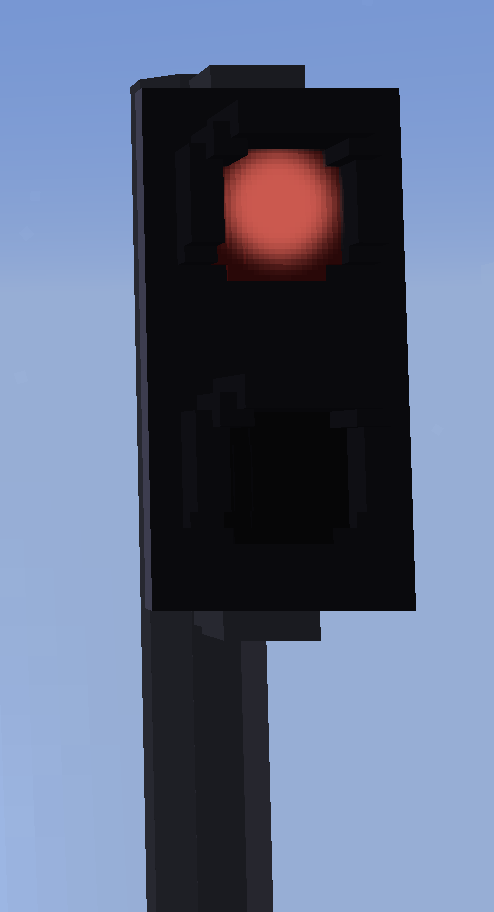
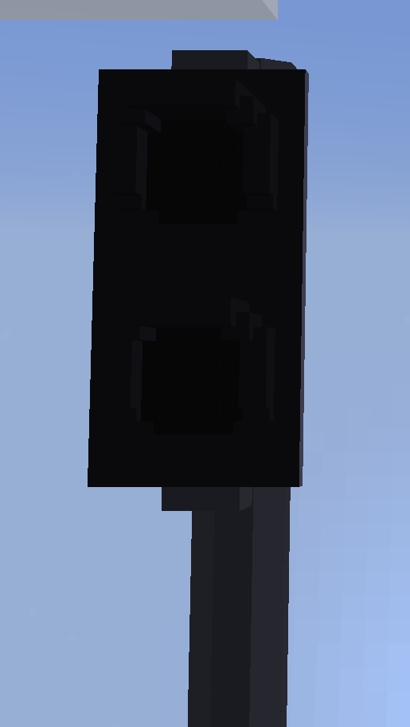

# Signals (BLOCKSIGNAL)

## Description

This is a simple signal, it has a more strict and simpler structure.<br />
It is more performance-friendly and requires fewer lines.<br />
It has only one controllable group and the model can only be changed via its texture.<br />
If this suits your needs, this is the preferable option.<br />
This is the successor of the previous signals from ContentPacksV1 

!!! info "This will lead you to the old contentpack v1 system:<br />[:octicons-arrow-right-24: Contentpack V1 documentation](../../ContentPackV1/ContentPacksV1.md)"

## Structure

``` json linenums="1" title="signal.json"
{
  "id": "pedestrian-light", // (1)!
  "name": "Pedestrian light (green/red)", // (2)!
  "model": "folder2/pedestrianlight.obj", // (3)!
  "states": [ // (9)!
    "green", // (10)!
    "red" // (11)!
  ],
  "itemState": "red", // (12)!
  "useBase": true, // (13)!
  "base": "basetexture", // (14)!
  "rotationSteps": 10, // (4)!
  "translation": [ // (5)!
    0.5,
    0,
    0.5
  ],
  "itemTranslation": [ // (6)!
    0.5,
    0,
    0.5
  ],
  "scaling": [ // (7)!
    1,
    1,
    1
  ],
  "itemScaling": [ // (8)!
    1,
    1,
    1
  ]
}
```

1.  !!! info "The identifier of the block and item."
    !!! failure "Required field!"
    
    !!! warning "Needs to be unique!<br />If more than one block within the same contentpack has the same id, only one will be loaded."
    
    !!! danger "Should not be changed!<br />Changing the id will break existing blocks."

2.  !!! info "The name of the block and item."
    !!! failure "Required field!"
    
    !!! note "Can be changed later on.<br />Does not have to be unique, although that helps."

3.  !!! info "The model of your block."
    !!! failure "Required field!"

    !!! tip "Path does not require `/assets/landofsignals/`."

    !!! warning "Currently only *.obj is supported!"

    !!! note "The name and content of the file can be changed later on."
        !!! warning "This may cause the UniversalModCore cache to break.<br />You can try to delete the `/cache/landofsignals/` folder in your minecraft instance."

4.  !!! info "The steps in which the block can be rotated."
    !!! quote "Optional field."
    !!! abstract "Default value: 10<br />Allowed values: 10 - 90"

    !!! note "Can be changed later on."

5.  !!! info "The translation of the block."
    !!! quote "Optional field."
    !!! abstract "Default value: 0,0,0"
        !!! warning "Values higher than 2 might cause issues with the block rendering."

    !!! warning "Is affected by `scaling` as `translation` happens afterward."

    !!! note "Can be changed later on."
        !!! warning "May screw up the positioning of existing blocks."

6.  !!! info "The translation of the item."
    !!! quote "Optional field."
    !!! abstract "Default value: 0,0,0"

    !!! warning "Is affected by `itemScaling` as `itemTranslation` happens afterward."

    !!! note "Can be changed later on."

7.  !!! info "The scaling of the block"
    !!! quote "Optional field."
    !!! abstract "Default value: 1,1,1"

    !!! note "Can be changed later on."
        !!! warning "Affects `translation` as `scaling` happens beforehand."
        !!! warning "May screw up the positioning of existing blocks."

8.  !!! info "The scaling of the item"
    !!! quote "Optional field."
    !!! abstract "Default value: 1,1,1"

    !!! note "Can be changed later on."
        !!! warning "Affects `itemTranslation` as `itemScaling` happens beforehand."

9.  !!! info "The different states your signal has."
    !!! failure "Required field!"
        !!! warning "Can be left away for backwards compatibility.<br />If your block only requires one state:<br />[:octicons-arrow-right-24: Asset](./Asset.md) [:octicons-arrow-right-24: Sign](./Sign.md)"
        !!! abstract "Default value: [ "" ]"

    !!! tip "Important information!<br />[:octicons-arrow-down-24: States](#states)<br />Remove below."    

    !!! info "`""` or `null` is a valid state.<br />Uses texture(s) that are within the same folder as the model (*.obj)."

    !!! note "Can be changed later on."
        !!! info "Adding new states is no issue."
        !!! warning "Changing the order of states may screw up existing signal logic circuits."
        !!! danger "Removing states may break existing blocks."

10. !!! note "The first state."

    !!! info "The state corresponds to a folder with the same name containing the textures for it."

    !!! tip "Important information!<br />[:octicons-arrow-down-24: States](#states)"

11. !!! note "The last state."

    !!! info "The state corresponds to a folder with the same name containing the textures for it."

    !!! tip "Important information!<br />[:octicons-arrow-down-24: States](#states)"

12. !!! note "The default state for items."
    !!! quote "Optional field."
    !!! abstract "Default value: first value of `states`"

    !!! tip "The state does not have to be part of the `states` list.<br />You could add a custom state for the item.<br /><br />Important information!<br />[:octicons-arrow-down-24: States](#states)"

    !!! note "Can be changed later on."

13. !!! note "Is there a base texture for this block?"
    !!! example "Optional experimental field.<br />Not recommended."
    !!! abstract "Default value: false<br />Allowed values: true, false"
    
    !!! note "Can be changed later on."

14. !!! note "Default textures that are always rendered independent of the current state."
    !!! example "Optional experimental field.<br />Not recommended."
    
    !!! note "Can be changed later on."
        !!! warning "Changing the name may cause the UniversalModCore cache to break.<br />You can try to delete the `/cache/landofsignals/` folder in your minecraft instance."

## States

This is about the different states your signal can posses and how the order affects other aspects of the game.<br />

### Implementation

Your signal can have one or more states. Previous contentpacks (V1) had some static blocks added as signals with a single state.
If you'd like to add something static as well, take a look at the [Signs](./Sign.md) and [Assets](./Asset.md).

Let's say your signal has 3 states: off, green, red.  (1)
{ .annotate }

1. !!! example "Example signal: off, green, red"
   


``` json linenums="1"
my-signal/
    green/
        my-signal.png // (1)!
    red/
        my-signal.png // (2)!
    my-signal.obj
    my-signal.mtl
    my-signal.png // (3)!
```

1.  
    
    !!! example "This texture would look like this: green"
    { width=50% }

2.  
   
    !!! example "This texture would look like this: red"
    { width=50% }

3.  

    !!! example "This texture would look like this: off"
    { width=50% }
    !!! info "This texture will be listed ingame as "Default.""
    !!! failure "This texture must always be available!"
    !!! warning "This is not necessarily the default texture! See below."

``` json linenums="1"
{
    "name": "My signal",
    "id": "my-signal",
    "model": "my-signal/my-signal.obj",
    "states": [
        "", // (3)!
        "green", // (1)!
        "red" // (2)!
    ],
```

1.  

    !!! example "This texture would look like this: green"
    { width=50% }

2.  

    !!! example "This texture would look like this: red"
    { width=50% }

3.  

    !!! example "This texture would look like this: off"
    { width=50% }
    !!! info "This texture will be listed ingame as "Default"."
    !!! failure "This texture must always be available!"
    !!! warning "This is not necessarily the default texture! See below."


### Sorting, priorities and overwriting of states

The default texture is always added. Either by the creator or by the mod.<br />
The mod will add the default texture, if not already added, to the first place of the list.<br />
It can be added as `""` (`null` works as well, will be transformed internally to `""`)

The order of the states will affect different things.<br />
The first state listed in your states will be used as "itemState" if not set otherwise in the JSON.

Also, the first state will always be the state of placed signals, if they are not overwritten by a signalbox.<br />
When using multiple signalboxes, the signal will store every set state.<br />
The displayed state will always be the latest in the states list.

!!! example "A few examples:"

    States: _Off (Default)_, _Green_, _Red_<br />
    When placed: _Off_<br />
    _Off_ & _Green_ active -> _Green_<br />
    _Green_ & _Red_ active -> _Red_<br />
    _Off_ & _Green_ & _Red_ active -> _Red_

    States: _Green_, _Red_, _Off (Default)_<br />
    When placed: _Green_<br />
    _Off_ & _Green_ active -> _Off_<br />
    _Green_ & _Red_ active -> _Red_<br />
    _Off_ & _Green_ & _Red_ active -> _Off_

!!! note "Priority"
    
    :material-arrow-up: Lowest - Off<br />
    :material-arrow-right: Second - Green<br />
    :material-arrow-down: Highest - Red

!!! tip "The order of states can be changed individually with a click on the signal block."

## Flares

<div class="grid cards" markdown>

-   :material-flare:{ .lg .middle } __Flares__ *(optional, nice to have)*

    ---

    { width="300" }
    { width="300" }

    If your model contains lamps or other parts that are supposed to glow, this is the right place.<br />
    Flares are oriented to your models and light up when the right state is set.<br />
    They can be added to signals, complex signals, deco/assets, signs and levers.

    [:octicons-arrow-right-24: Flare documentation](./Flares.md)

</div>