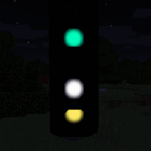

# Creating your own V2 contentpacks

Your contentpacks is made up from multiple parts, you can find a short description and the documentation here:

-   :material-file:{ .lg .middle } __landofsignals.json__ *(required)*

    ---

    This file contains the name, author, version of your contentpack. 
    It also contains links to your blocks or contentsets.

    [:octicons-arrow-right-24: Header documentation](./Content/Header.md)

-   :vertical_traffic_light:{ .lg .middle } __Signal__

    ---

    { width="300" }

    This is a simple signal, it has a more strict and simpler structure. 
    It is more performance-friendly and requires fewer lines. 
    It has only one controllable group and the model can only be changed via its texture. 
    If this suits your needs, this is the preferable option.

    [:octicons-arrow-right-24: Signal documentation](#)

-   :material-traffic-light:{ .lg .middle } __Complex signal__

    ---

    { width="300" }

    This is a complex signal, its flexible and opens a lot of options. 
    It is less performance-friendly and needs a lot more lines. 
    It can have multiple independently controllable groups. 
    The state can be changed via texture, obj-groups or with different objs. 
    If you have a model/multiple models or want to create a complex block, this is your best option.

    [:octicons-arrow-right-24: Complex signal documentation](#)

-   :material-traffic-cone:{ .lg .middle } __Asset/Deco__

    ---

    { width="300" }

    Blocks that are not supposed to have any functionality can be added as a DECO block. 
    They have their own creative tab.

    [:octicons-arrow-right-24: Asset/Deco documentation](#)

-   :material-sign-caution:{ .lg .middle } __Sign__

    ---

    { width="300" }

    Signs are similar to assets/deco blocks, they have their own creative tab. 
    They are supposed to support text-input in the future. *(TBD see #120)*
    
    [:octicons-arrow-right-24: Sign documentation](#)

-   :material-door-sliding:{ .lg .middle } __Signalbox__

    ---

    { width="300" }
-

    Signalboxes are similar to assets/deco blocks. 
    They can be connected to (complex) signals to control them.
    
    [:octicons-arrow-right-24: Sign documentation](#)

-   :material-electric-switch:{ .lg .middle } __Lever__

    ---

    { width="300" }

    The newest addition: Levers! 
    If you want to add a custom lever/switch that emits redstone when active, this is it. 
    It is similar to the signs and assets/deco - difference: You have to state an active and inactive state.

    [:octicons-arrow-right-24: Lever documentation](#)

-   :material-flare:{ .lg .middle } __Flares__ *(optional, nice to have)*

    ---

    { width="300" }
    { width="300" }

    If your model contains lamps or other parts that are supposed to glow, this is the right place. 
    Flares are oriented to your models and light up when the right state is set. 
    They can be added to signals, complex signals, deco/assets, signs and levers.

    > *Documentation to be created (#133)*

-   :material-format-list-group:{ .lg .middle } __Contentsets__ *(optional)*

    ---

    This is its own file containing more blocks. 
    It does not contain any logic, the only advantage is that you can group different blocks in your contentpack that belong together. 
    It can help with keeping an overview, depending on the amount of blocks you want to add.

    [:octicons-arrow-right-24: Contentset documentation](#)

