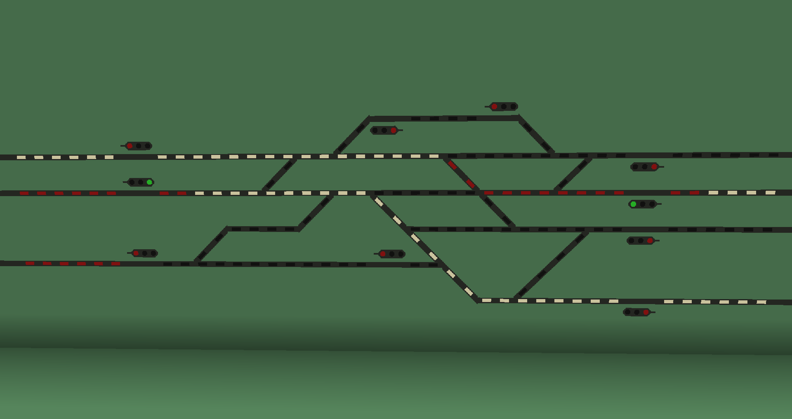
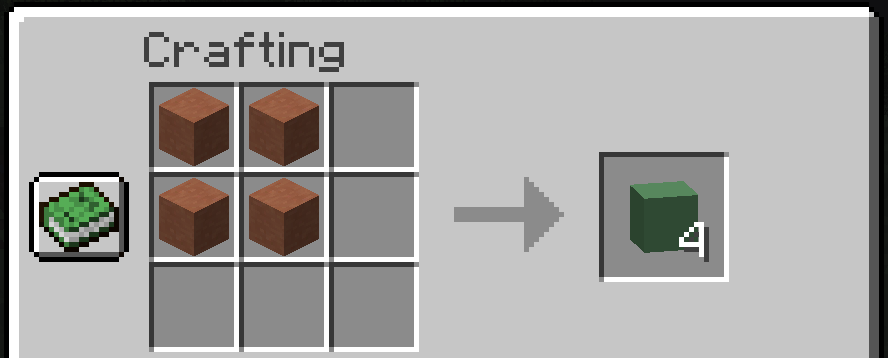
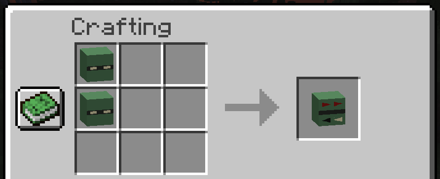
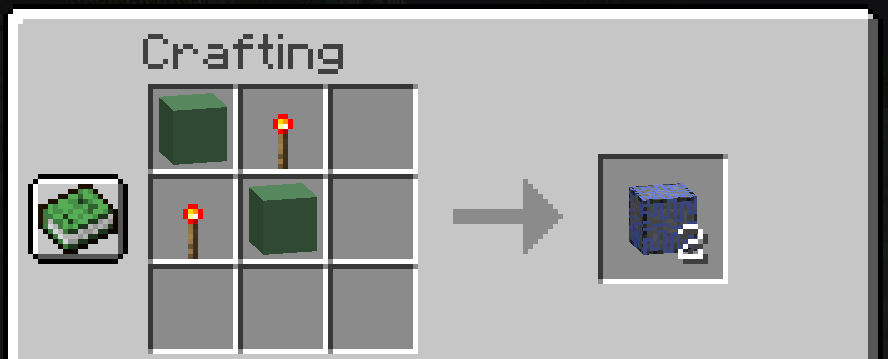
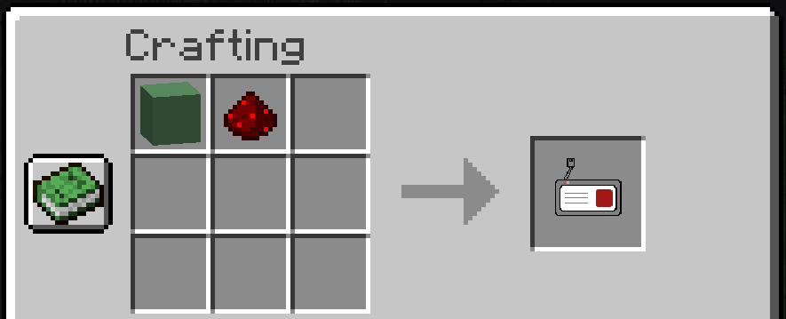
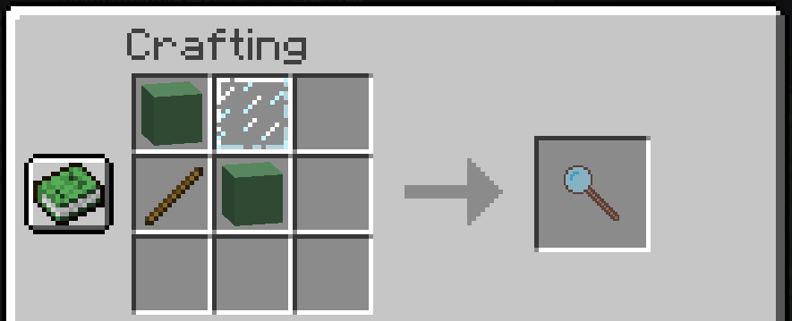

[... back to README.md][README]

# Stellwand

## Usage

Usage

Blocks:

* Sender: Block that is connected to one or multiple signals and adds signalmodes. To activate it, just give it a
  redstone signal. A sender can only control one lamp (=signalgroup). Can be connected with multiple signals of the same
  type.
* Signal: Block that can display multiple signals, but has only one displayable lamp (=signalgroup). Can be connected to
  multiple senders.
* Multisignal: Block that can display multiple signals and has multiple displayable lamps (=signalgroups). Can be
  connected to multiple senders.
* Filler: Block that has no special functionality and only is decorative

Items:

* Connector: Used to connect senders and signals.
* Magnifying glass: Used to show which signals are connected to a sender.

Connecting senders and signals:

1. Get your connector.
2. Click on either the sender or signal. (Your connector will turn either blue or green)
3. Now click on the opposite block. (Your chat should show it connected)

## Recipes

Recipes

### Blockfiller

`4 Terracotta` create `4 Blockfillers`.

### Blocksignal

`2 Blockfillers and 2 Redstonedust` create `2 Blocksignals`.

### Blockmultisignal

`2 Blocksignals` create `1 Blockmultisignal`. 
***Info:*** The `Blocksignals` need to be on top of each other.

### Blocksender

`2 Blockfillers and 2 Redstonetorches` create `2 Blocksenders`.

### Connector

`1 Blockfiller and 1 Redstonedust` create `1 Connector`. 
***Info:*** The `Blockfiller` needs to be left of the `Redstonedust`.

### Magnifying glass

`2 Blockfillers, 1 Glasspane and 1 Stick` create `1 Magnifying glass`.

## Config

Config

Configurations done over the stellwand.cfg only refresh on restart.

### debugging > debugOutput

> Default: false

Enables debug logging for further inspection of issues.

### disableRecipes

> Default: false

Removes every recipe; effectively making it creative-only.

### disableStellwand

> Default: false

**Extreme option. Disables the stellwand part completely. 
Will break every already existing block/item from stellwand. 
Should only be used with the intention of disabling it from the start.** 

***If you have issues if the stellwand part, state your issue on our discord first.***

## Contentpacks

Contentpacks

### Contentpacks available:

* Non right now, see the next chapter to change this. ;)

### Creating a contentpack:

[Documentation on how to create a contentpack](./contentpacks/Stellwand_Contentpacks.md)

## Features planned

Features planned

* Buttons for interaction (currently in development)
* Sender with multiple functions (blinking)
* LandOfSignalsAPI containing methods for retrieving directionFrom/directionTo from all blocks available

### Changes to documentation

| _Date_     | _Author_   | _Changes_                       |
|------------|------------|---------------------------------|
| 15.01.2022 | Danielxs01 | Initial creation                |
| 31.01.2022 | Danielxs01 | Finalization v1.0               |
| 02.02.2022 | Danielxs01 | Added Recipes and Configoptions |
|            |            |                                 |

[... back to README.md][README]

<!-- Links -->

[README]: ../../README.md